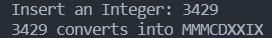
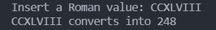

<h1 style="text-align: center;">Integer <-> Roman</h1>

<h3 style="text-align: center;">Note ⚠️</h3>
Only converts numbers from 1 to 4999 (numbers higher than 4999 have a specific symbology)

Integer -> Roman           | Roman -> Integer
:-------------------------:|:-------------------------:
 | 
