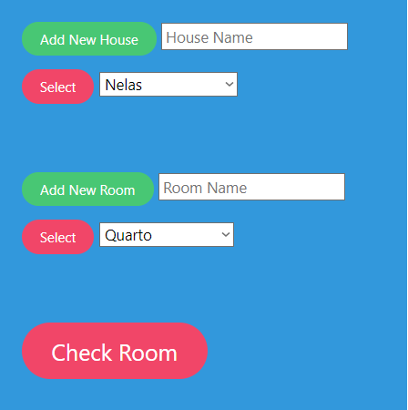
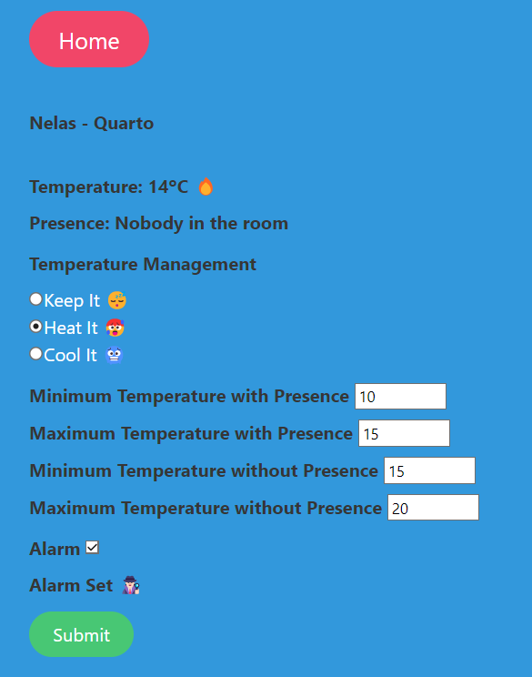

<h1 style="text-align: center;">IoT Home</h1>

<h2 style="text-align: center;">About</h2>

This was the 3rd ***SCM*** (Mobile Communication Services) assignment.

Through a **web application**, you are able to **control the temperature** of your home air conditioners and **set LED alarms** when any movement is detected in any configured room.

All this using several ***esp8266*** devices connected to your home WiFi network and messaging through ***MQTT*** messages.

Main Menu                  |  Room Menu
:-------------------------:|:-------------------------:
 | 

___ 
