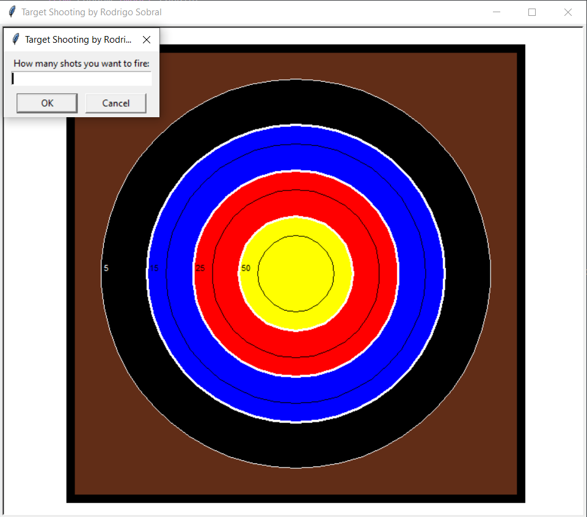
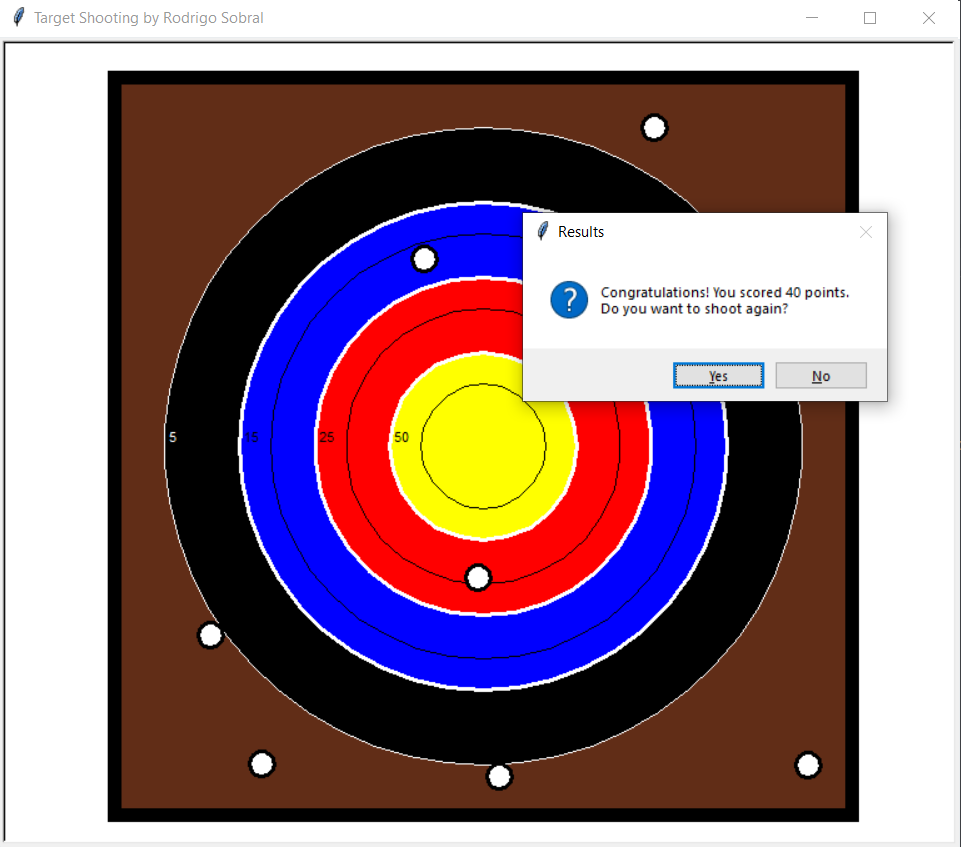
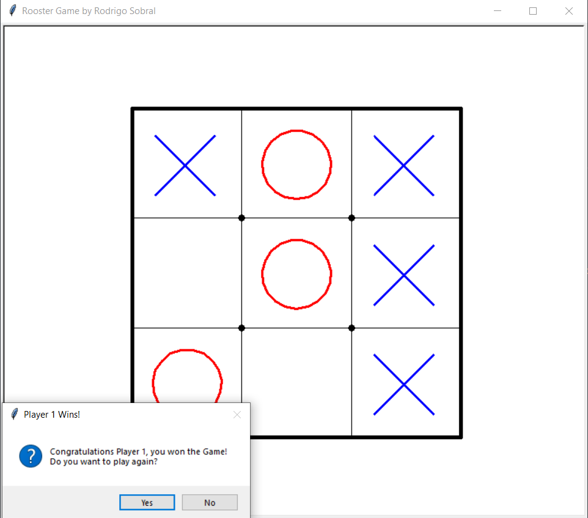
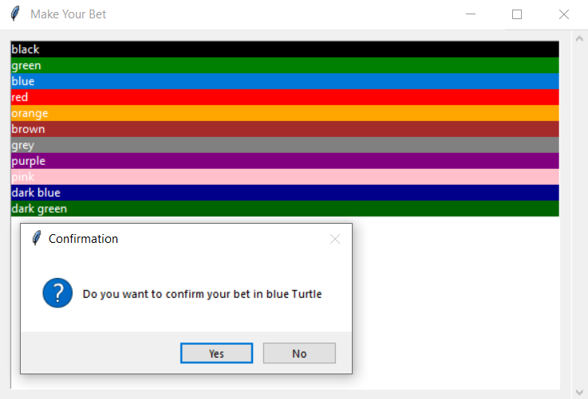
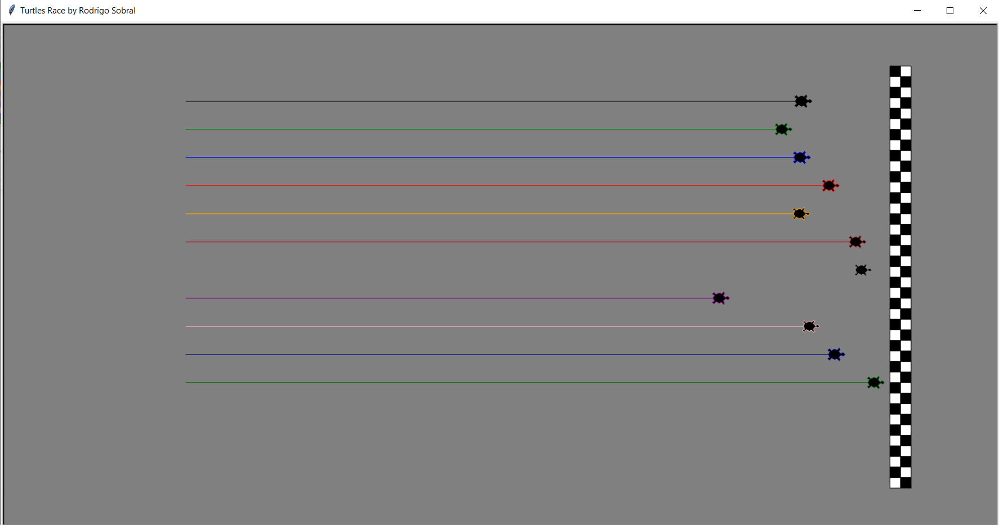

# Python Projects

___ 

## Integer <-> Roman 

Note: only converts numbers from 1 to 4999 (numbers higher than 4999 have a specific symbology)

___ 

## Target Shooting

___ 

## Tic Tac Toe Game

___ 

## Turtles Race

___ 

## Scheduler Discord Bot

___ 